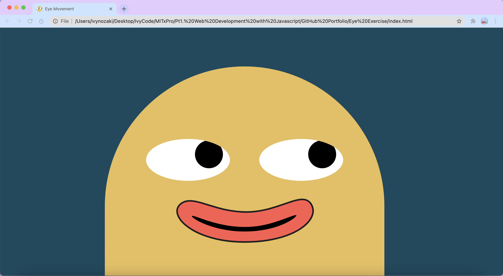
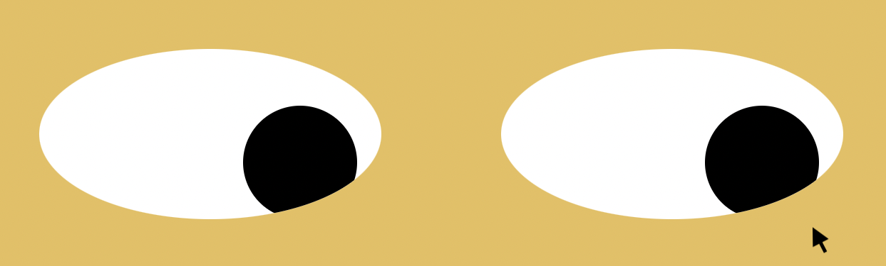
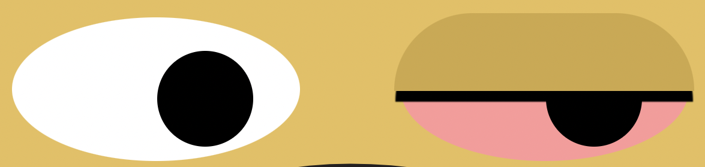
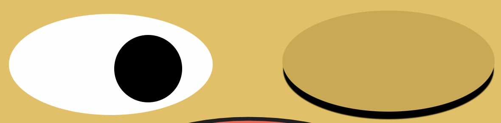
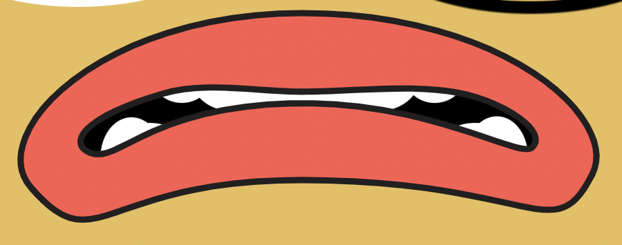

# Eyes Excercise

---

## **Description**

Interactive website for mouse events. This website uses several mouse events like onmousemove, onmouseover and onmouseout that affect the creature.

---

## **How to run**

**onmousemove**: The eyes will follow the movement of the mouse within the webpage.

**onmouseover eye/s**: The eyes will turn pink, wince and then close.

The mouth will also change to a frown.

**onmouseout eye/s**: The eyes will reopen to original state after 2.5 seconds as well as return the mouth back to a smile.

---

## **Road Map**

1. Add feature to pet creature's head which changes mouth to an open smile.
2. Add feature to twitch eyes when mouse is on eye/s.

---

## **Licenses**

- MIT
- Image was created by using Affinity Designer.
- Custom styling and code using HTML, CSS and JavaScript.
