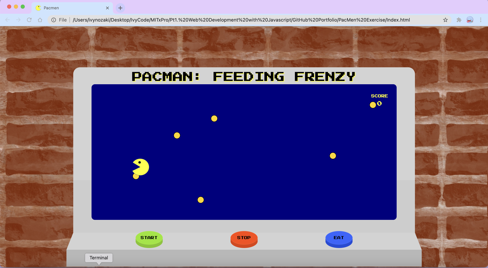

# **PacMen Exercise**

## **Description**

**PacMan: Feeding Frenzy**
A mini simulation of an arcade game. The objective of the game is to eat as much pellets as you can.

---

## **How to run**

There are 3 buttons for the "machine": START, STOP and FEED. The top right of the game screen there is a Score board.

_3D buttons that flattens when clicked._

The **START** button inputs the pacman into the game as well as activate the pellets to drop.

Pacman moves randomly within the the set parameters of the game screen. Snack pellets will randomly drop from the top of the game screen.

The **STOP** button refreshes the game screen.

The **EAT** button is to make Pacman eat the pellet that it is currently in contact with.

The **Score board** will keep the count of pellets eaten by Pacmen.

At start:

Progression:

---

## **Road Map**

1. Add a speed feature that either speeds up or slows down pacman's movement.

2. Add a challenge.

- Add ghosts that drop down randomly like the pellets that will end game upon contact with pacman.
- Set consequence for missed snack pellets.
- Increase drop speed as score passes certain points.

3. Allow player to move Pacman using arrow keys but continue to Pacman move randomly when arrow keys not in use.

---

## **Licenses**

- MIT
- Google Fonts
- Background image was created by using Procreate.
- Custom styling and code using HTML, CSS and JavaScript.
