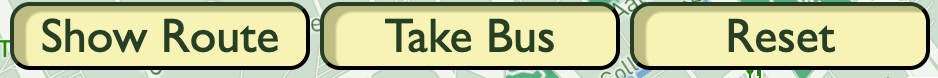
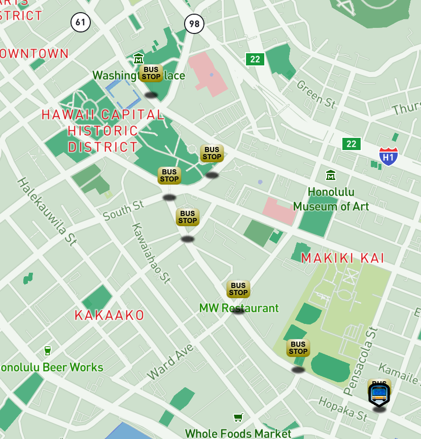
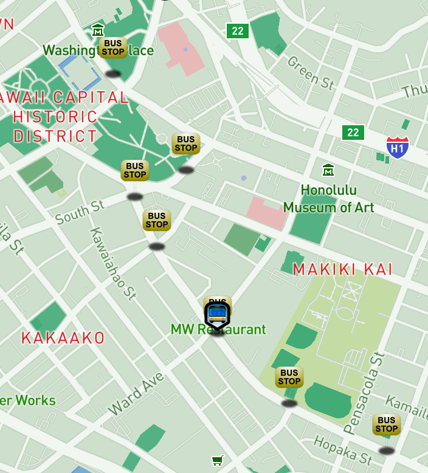

# **Real Time Bus Tracker**

## **Description**

An interactive map of the Honolulu district on the island of Oahu, Hawaii that shows the bus route from the Ala Moana Shopping Center to the State Capitol building.

---

## **How to Run**

Interactive Buttons

**Show Route** Button will show all the bus stops along the route.

**Take Bus** will move the bus icon along the route until it arrives at the final stop.

**Reset** will clear the map to its original state.

## 

---

## **Road Map**

- Make the bus marker move along the road instead of just jumping from one stop to the next.
- Clear the bus stop marker once the bus marker reaches that stop.

---

## **Icons**

Bus Marker

Bus Stop Marker

Favicon

---

## **Licenses**

- MIT
- This project was built by using Mapbox's API. [Link: mapbox.com](https://www.mapbox.com)
- SVG images were created by using Affinity designer.
- Custom styling and code using HTML, CSS and JavaScript.
